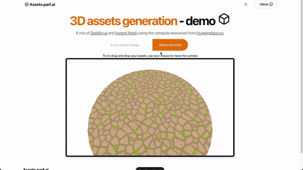

# assets.parf.ai

## INTRODUCTION

This project is a demo featuring 3D assets generation for my job application at Electronic Arts to showcase some of my skills and my motivation to join this new team.

- **PROD**: https://assets.parf.ai/
- **DEV**: https://dev.assets.parf.ai/

I did it on Saturday December 7th, it uses the api of Stability.ai and the api of Hugging face from [another project](https://huggingface.co/spaces/ThomasSimonini/Roblox-3D-Assets-Generator-v1) so that I can use an A100 for free for the demo. 

I could have used the assets generation API from Stability.ai but the only thing I have to pay here is the 2D image generation. 

I was short on time so I focused my attention to deliver it in a day. I'm happy to do some modification.

If you want to check a project related to MLOps, I recommend [this anomaly detection project](https://github.com/emergy-official/anomaly.parf.ai) alongside [an article](https://docs.edgeimpulse.com/experts/featured-machine-learning-projects/fomo-ad-in-aws) I wrote for Edge Impulse.